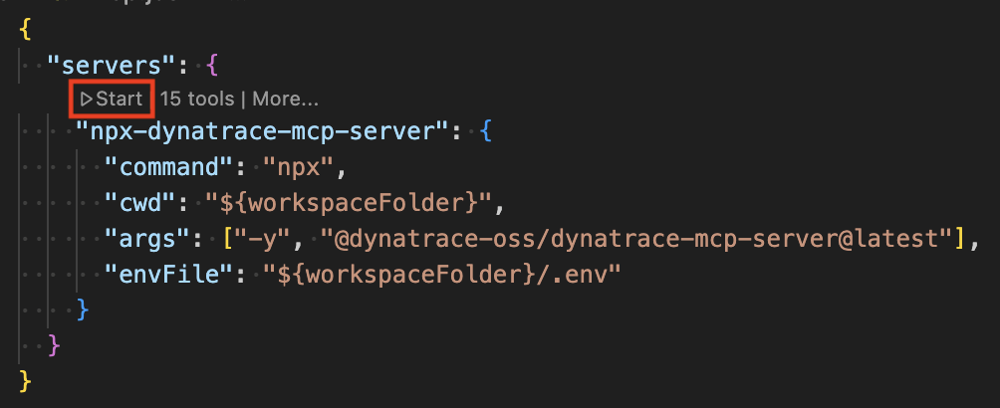
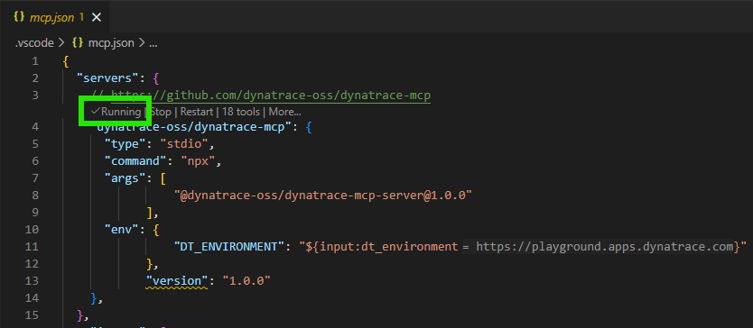
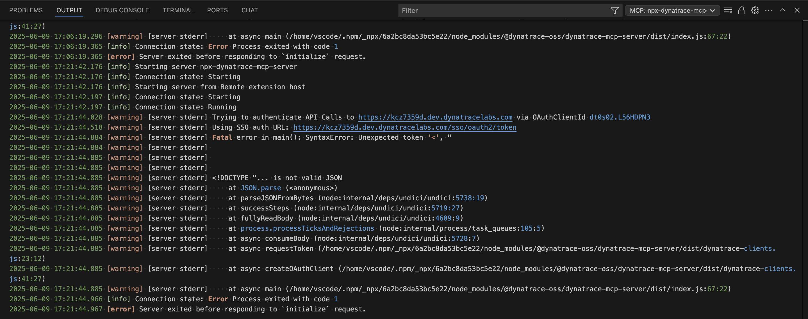
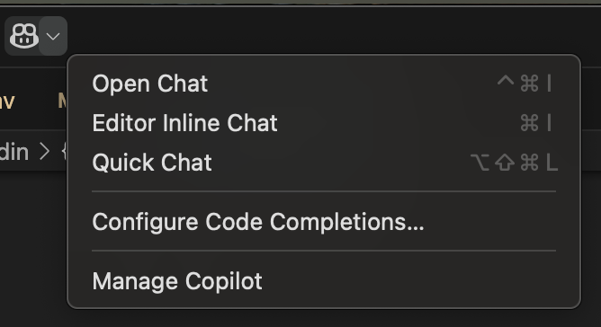

# Dynatrace MCP Playground

This repo is used primarily for experimenting with the [Dynatrace MCP server](https://dt-url.net/mcp) and will be used for the DevHUB Sessions at [Dynatrace Perform 2026](https://www.dynatrace.com/perform/)

Follow these steps and you will learn: <br>
👉 What is an MCP<br>
👉 How to setup the Dynatrace MCP Server<br>
👉 How to connect to a Dynatrace environment<br>
👉 How to execute pre-defined prompts<br>
👉 how to ask any question to Dynatrace<br>

## Learn more about MCPs

Check out Adriana's blog post on to learn more about MCPs together [here](https://dt-url.net/mcp-medium).

You can also check out other MCP servers [here](https://github.com/modelcontextprotocol/servers?tab=readme-ov-file).

## Why use the Dynatrace MCP Server?

This approach makes Dynatrace data accessible to team members who may not be familiar with DQL (Dynatrace Query Language) or APIs, democratizing observability data across your organization.

Key Takeaways:
* Natural Language Queries: Interact with Dynatrace without writing complex API calls or DQL queries
* Reusable Prompts: Save time with pre-built queries stored as files
* AI-Powered Analysis: Let Copilot handle complex, multi-step queries automatically

## Setup

You can run this tutorial in two ways

1. Fork this GitHub repo and launch the Codespace. Once its up you are in Visual Studio and you are ready to go
2. Clone this GitHub repo locally in open it in your local Visual Studio Code instance!

### Step 1: Enable MCP support in VSCode

This tutorial uses the Visual Studio Code (VSCode) [built-in GitHub Copilot chat support](https://code.visualstudio.com/docs/copilot/customization/mcp-servers#_enable-mcp-support-in-vs-code). Copilot supports multiple large language models (LLMs), including GPT-4 and Claude, so feel free to select your favorite. 

Before you can use GitHub Copilot chat, however, you’ll need to [enable MCP support in VSCode](https://code.visualstudio.com/docs/copilot/customization/mcp-servers#_enable-mcp-support-in-vs-code). You can do this by adding “chat.mcp.enabled”: true to your VSCode [`settings.json`](https://code.visualstudio.com/docs/getstarted/settings#_settings-json-file) file. 

### Step 2: Configure Dynatrace MCP server 

The LLM used by GitHub Copilot chat talks to Dynatrace via the [Dynatrace MCP server](https://dt-url.net/mcp). For that to happen, we must make Copilot aware of the Dynatrace MCP server, which I’ll show you below.

If you open up [`.vscode/mcp.json`](.vscode/mcp.json), you'll notice the existing configuration for the Dynatrace MCP server:

```json
{ 
  "servers": {
    // https://github.com/dynatrace-oss/dynatrace-mcp
    "dynatrace-oss/dynatrace-mcp": {
      "type": "stdio",
      "command": "npx",
      "args": [
				"@dynatrace-oss/dynatrace-mcp-server@1.0.0"
			],      
      "env": {
				"DT_ENVIRONMENT": "${input:dt_environment}"
			},			
			"version": "1.0.0"
    },
  }, 
	"inputs": [
		{
			"id": "dt_environment",
			"type": "promptString",
			"description": "Dynatrace Platform URL (e.g., https://abc12345.apps.dynatrace.com — not classic live.dynatrace.com).",
			"password": false
		}
	]
}
```

Let’s take a closer look at the above JSON:
* `dynatrace-oss/dynatrace-mcp`: the name of the MCP server. This name can be anything you want, even Dynatrace MCP server, spaces and all.
* `type`: The connection type. Valid values are: `stdio`, `sse`, and `http`. We’re using `stdio`, which means that a copy of the Dynatrace MCP server runs locally in VSCode. `sse` and `http` are used for accessing remote MCP servers. For more information on remote vs. local MCP servers, check out [this great overview](https://www.apideck.com/blog/understanding-local-and-remote-model-context-protocols). Dynatrace also provides a Remote MCP Server option which is - as the time of this writing - in Preview. Read more [here](https://www.dynatrace.com/hub/detail/dynatrace-mcp-server)
* `command`: The command to run the MCP server. Since the type is `stdio`, the Dynatrace MCP server will run locally, which requires a command to run the server. The Dynatrace MCP server is available as an executable npm package, so it uses the `npx` command to run it (already installed in this dev container).
* `args`: The arguments passed to the npx command. Here, we have 2 `args`. the `-y` arg tells npx to install dependent packages without prompting, and the second arg includes the package name (`dynatrace-oss/dynatrace-mcp-server`), and version (`v0.10.0`). If you want to use a version other than latest, check out the [list of available versions of the Dynatrace MCP server](https://github.com/dynatrace-oss/dynatrace-mcp/tags).
* `env`: Environment variable that specifies the Dynatrace Tenant to connect to. This one will be prompted by Visual Studio once we start the server. 

### Step 3: Start the Dynatrace MCP server

To start the MCP server, open mcp.json in VSCode, and click “Start”, located just above `dynatrace-oss/dynatrace-mcp`.



Visual Studio code will prompt you to enter the Dynatrace Tenant URL. To connect to the Dynatrace Playground please enter: `https://playground.apps.dynatrace.com`

After that VSCode will open a browser to authenticate against the playground. As everyone with a Dynatrace SaaS account has access to the Playground you should be good to go!

Once the MCP server is started, you should see “Running” in place of “Start”:



If your MCP server fails to start up, you’ll be able to see error logs in the Output tab in VSCode:



### Step 4: Start up the chatbot

Before we can start talking to Dynatrace, we need to open up the Copilot chat window. to open the chat window, select the on the chat icon just to the right of the [command palette in VSCode](https://code.visualstudio.com/api/ux-guidelines/command-palette), and select “Open Chat”.



This will open up a chat window. You will also be prompted to enable GitHub Copilot, if you don’t already have it enabled.

> ✨ **NOTE:** [GitHub copilot includes a free tier](https://github.com/features/copilot/plans), which limits you 50 agent mode or chat requests per month.

Once the chat is enabled, make sure that your chat is set to “Agent” mode. Agent mode allows copilot to do things on your behalf, like modify code and configurations, depending on what MCP servers it’s interacting with. Ask mode is used for lookups and research type tasks. Edit mode lies somewhere in between. Learn more about the modes [here](https://github.blog/ai-and-ml/github-copilot/copilot-ask-edit-and-agent-modes-what-they-do-and-when-to-use-them/).

To switch modes, go to the bottom right-hand side of the chat input box. This will open a list of available chat modes.


### Step 5: Validate we are connected to Dynatrace!

The first question we can ask is
```
What Dynatrace environment are we connected to?
```

It should give you an answer similar to this
```
You're connected to the Dynatrace Playground environment:

Environment ID: wkf10640
URL: https://playground.apps.dynatrace.com
Type: INTERNAL
State: ACTIVE
Created: April 19, 2023
This is Dynatrace's shared playground environment for testing and exploration.
```

### Step 6: Talk to Dynatrace via Prompts!

We have created [prompt files](https://code.visualstudio.com/docs/copilot/customization/prompt-files) and an [instructions file](https://code.visualstudio.com/docs/copilot/customization/custom-instructions) for more detailed interactions with the [OpenTelemetry Demo app](https://github.com/open-telemetry/opentelemetry-demo) (Astroshop) via the Dynatrace MCP server.

To run the prompt files, open up Copilot chat, and type in `/`. This will bring up a list of available prompts. Note that Copilot looks for prompt files in the [`.github/prompts`](.github/prompts/) folder. All prompt files must have a `.prompt.md` extension.

Here are the prompts to execute:
* `/01-num-dynatrace-services.prompt.md` -> How many services are running in Dynatrace astroshop namespace?
* `/02-avg-response-time.prompt.md` -> Give me the avg response time per service in the astroshop namespace?
* `/03-logs-associated-with-services.prompt.md` -> How many astroshop services have associated logs?
* `/04-last-five-traces.prompt.md` -> Show me the last 5 traces, include spand id, trace is, start time, end time and number of associated logs for x service?
* `/05-logs-associated-with-given-span.prompt.md` -> Show me the latest log messages for the most span in Dynatrace that has associated logs.
* `/06-error-rate-by-service.prompt.md` -> What is the error rate by service?
* `/07-error-count-by-namespace.prompt.md` -> What is the error count by namespace?
* `/08-slow-operations.prompt.md` -> Show me slow operations
* `/09-percentile-latencies.prompt.md` -> Show me percentile latencies
* `/10-service-dependencies.prompt.md` -> Show me service dependencies
* `/11-conversion-funnel.prompt.md` -> Show me conversion funnel analysis
* `/12-pod-health.prompt.md` -> Show me pod health status
* `/13-time-comparison.prompt.md` -> Show me time-based comparison analysis

### Step 7: Try additional prompts

While the existing prompts are easy to execute you can also ask Copilot any type of questions that it will then try to answer by reaching out to Dynatrace in case it thinks Dynatrace has the answer.

Some additional ideas to get you started
* What are the top critical logs?
* Whats the slowest distributed trace?
* Are there any active problems?

Give those a try and come up with some additional questions

### Step 8: Looking behind the scenes

You can always create your own prompts or define your own instructions to give Copilot more context when you ask questions. 
Have a look at [](.github/copilot-instructions.md) to see some global instructions we defined for Copilot. Those are also best practices such as using data query limit defaults, or, suggesting certain output formats!

### Step 9: Fork, Extend, Pull Request

If you create your own prompts or instruction files feel free to open a Pull Request to this repository. It would be great to collaborate!

## Resources

Learn more about prompt files in VSCode:
* [Prompt files overview](https://code.visualstudio.com/docs/copilot/customization/prompt-files)
* [Instructions overview](https://code.visualstudio.com/docs/copilot/customization/custom-instructions)
* [awesome-copilot repo on GitHub](https://github.com/github/awesome-copilot)
* [Instructions and Prompt Files to supercharge VS Code with GitHub Copilot](https://dev.to/pwd9000/supercharge-vscode-github-copilot-using-instructions-and-prompt-files-2p5e)